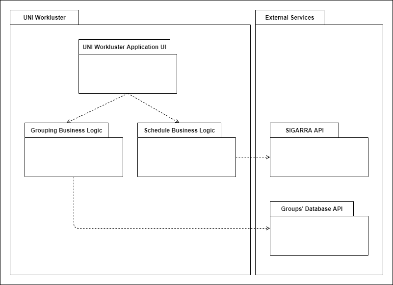

## Architecture and Design

The UNI Workluster app will run on Android OS (and possibly iOS) and relies on the SIGARRA API for getting the student's weekly schedule and on a custom database for saving the grouping information (student's looking for groups, formed groups, etc.).

### Logical architecture

- **UNI Workluster Application**: Represents the app's logical package that emcompasses both the Grouping Business Logic and Schedule Business Logic.
- **Grouping Business Logic**: Represents the Groups' logical package, responsible for everything related to the Group forming feature.
- **Schedule Business Logic**: Represents the Schedules' logical package, responsible for everything related to the Schedule overlapping feature.
- **SIGARRA API**: Represents the SIGARRA's logical package, responsible for the communication with SIGARRA's database.
- **Groups' Database API**: Represents the Groups' Database logical package, responsible for the Groups' data storage.

### Physical architecture

- **UNI Workluster Application**: Represents the app developed with Flutter (based on the programming language Dart)
- **Phone**: Represents a user's smartphone, the hardware where the app is going to run. It can have either an Android OS or IOS.
- **Grouping Management Service**: Represents the backend related to the Group forming feature, that manages the respective database.
- **Groups' Database**: Represents the Groups' Database where the data  related to the Group forming feature is stored.
- **Groups' Server**: Represents the hardware hosting the Groups' Database.
- **SIGARRA API**: Represents SIGARRA's interface responsible for the communication with SIGARRA's database.
- **SIGARRA's Server**: Represents the hardware hosting SIGARRA's database.

### Vertical prototype

Our vertical prototype shows a Welcoming Home page with a button that, when pressed, displays some information about the app.

Namely a quick message saying the app is under development and that it will enable students to easily form groups with other students. It also displays the list of developers working on the project

