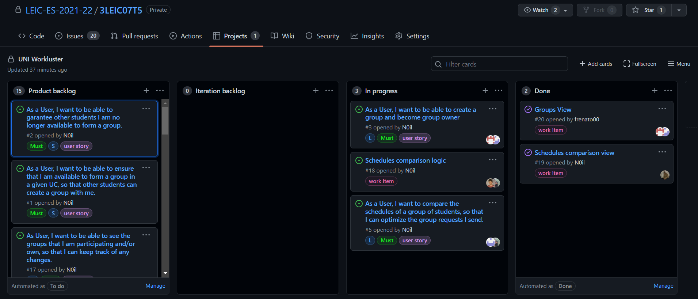

# Retrospective of the First Iteration

Link to the release: 

- What went well?
The members working on the same issue, worked together, without any problems.

- What should we do differently?
We should divide the issues in more work items so that our progress is valued even when we don't close a big issue. 
We are going to invest more time in this project to catch up.

- What still puzzles me?
We think that easy and simple features take a long time to implement because of our need to learn the code already written.  
  

The state of the board at the end of the first iteration.