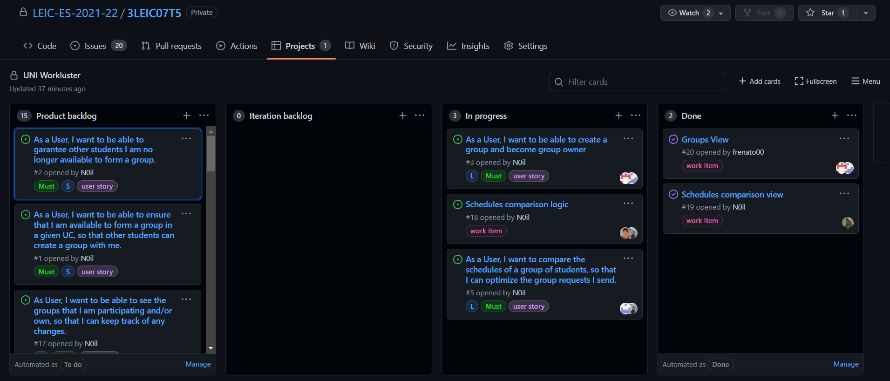
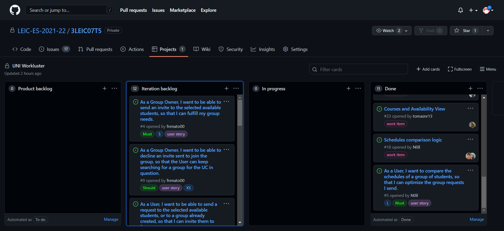

# Retrospective of the Second Iteration

Link to the release: https://github.com/LEIC-ES-2021-22/3LEIC07T5/releases/tag/v2

- What went well?
The members working on the same issue, worked together, without any problems. The objectives were accomplished.

- What should we do differently?
We should focus on integrating everything that's being developed by the different members

- What still puzzles me?
We think that easy and simple features take a long time to implement because of our need to learn the code already written. 

Implemented Issues:

 - #1 As a User, I want to be able to ensure that I am available to form a group in a given UC, so that other students can create a group with me. 
 - #2 As a User, I want to be able to garantee other students I am no longer available to form a group.
 - #3 As a User, I want to be able to create a group and become group owner
 - #5 As a User, I want to compare the schedules of a group of students, so that I can optimize the group requests I send.
 - #17 As User, I want to be able to see the groups that I am participating and/or own, so that I can keep track of any changes.

The state of the board at the end of the previous iteration.

The state of the board at the end of the second iteration.
