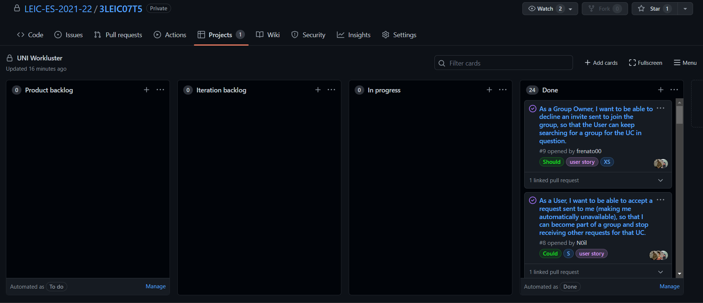

# Retrospective of the Third Iteration

Link to the release: https://github.com/LEIC-ES-2021-22/3LEIC07T5/releases/tag/v3

- What went well?
We were able to finish the product in a complete and stable state. Team coordination on the final issues went smoothly.

- What should we do differently?
We should plan the issues and releases in a more breath-first approach, so that we are able to have better mid-development releases and avoid changing features to much in the final release. 

- What still puzzles me?
We wanted to implement a database but since it was out of the project's scope, we had to implement an interface that's ready for a database but using local files. 

Implemented Issues:

 - #4 As a Group Owner, I want to be able to send an invite to the selected available students, so that I can fulfill my group needs. 
 - #6 As a User, I want to be able to send a request to the selected available students, or to a group already created, so that I can invite them to form a group.
 - #7 As a Group Owner, I want to be able to accept an invite sent to join the group, so that the User becomes part of the group.
 - #8 As a User, I want to be able to accept a request sent to me (making me automatically unavailable), so that I can become part of a group and stop receiving other requests for that UC.
 - #9 As a Group Owner, I want to be able to decline an invite sent to join the group, so that the User can keep searching for a group for the UC in question.
 - #11 As a Group Owner, I want to be able to send a Group Merge Request to another Group Owner, so that I can show them I'm interested in merging our groups together.
 - #13 As a Group Owner, I want to be able to accept a Group Merge Request, so that our groups are merged together.
 - #14 As a Group Member, I want to be able to leave my current group, so that I can search for a new one.
 - #15 As a Group Owner, I want to be able to decline a Group Merge Request, so that our groups aren't merged together and we can continue our search to complete the group.
 - #16 As a Group Owner, I want to be able to expel a Group Member, so that said Member isn't a part of my group anymore and he can restart searching for a group for the UC in question.
 - #23 Courses and Availability View.
 - #24 Schedules comparison input.
 - #25 Schedules comparison time slot model.
 - #30 Get and Set Groups from Database.

The state of the board at the end of the previous iteration.

The state of the board at the end of the second iteration.
