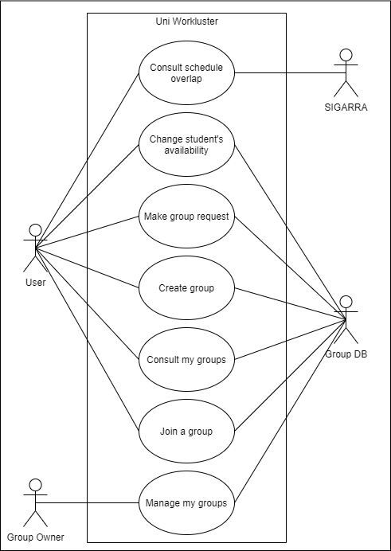
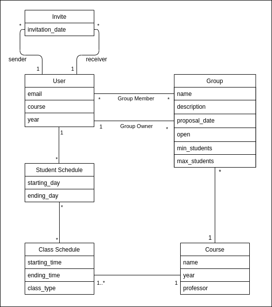

## Requirements

In this section are described all the module functional and non-functional requirements.

## Use Cases

|                 |                                                                                                                                                                                                        |
|----------------------------------|--------------------------------------------------------------------------------------------------------------------------------------------------------------------------------------------------------|
| Name                             | Change student's availability                                                                                                                                                                            |
| Actor                            | User                                                                                                                                                                                                     |
| Description                      | The student shows that he's available to create a group for a certain course.                                                                                                                          |
| Preconditions                    | The student is registered in the course. The student is willing to create a group in that course.                                                                                                   |
| Postconditions                   | The student availability becomes visible to other users of the app, which are registered in the same course.                                                                                           |
| Normal flow                      | 1. The student accesses the app.   2. From all of the courses on which he is registered, the student chooses the desired one to show is availability.   3. His availability is shown on the app. |
| Alternative flows and exceptions | If the student is already on a group, only it's manager can change it's availability (from available to not available).                                                                                                                                                                                                   |                                                                                                                                                                                                     |

|                                  |                                                                                                                                                                                                                                                                                                                                                                                                                 |
|----------------------------------|-----------------------------------------------------------------------------------------------------------------------------------------------------------------------------------------------------------------------------------------------------------------------------------------------------------------------------------------------------------------------------------------------------------------|
| Name                             | Group request                                                                                                                                                                                                                                                                                                                                                                                                   |
| Actor                            | User                                                                                                                                                                                                                                                                                                                                                                                                         |
| Description                      | The student makes a request to create a group with other student in the same course.                                                                                                                                                                                                                                                                                                                            |
| Preconditions                    | The other student is registered in the same course as the user.  The targeted student is available in the app.                                                                                                                                                                                                                                                                                           |
| Postconditions                   | The target of the request is notified through the app that the user wants to create a group with them.                                                                                                                                                                                                                                                                                                          |
| Normal flow                      | 1. The student accesses the app.  2. The student chooses the course on which he wants to create a group.   3. He then checks the availability of other students.  4. After that, he chooses the student who he wants to create a group with.  5. The student sends a group request to the desired student.  6. The targeted student is notified via app (and/or via email). |
| Alternative flows and exceptions | If a certain group is still available, the student can send them a group request too, which gets sent to the group manager                                                                                   |

|                                  |                                                                                                                                                                                                                                                     |
|----------------------------------|-----------------------------------------------------------------------------------------------------------------------------------------------------------------------------------------------------------------------------------------------------|
| Name                             | Create group                                                                                                                                                                                                                                        |
| Actor                            | User                                                                                                                                                                                                                               |
| Description                      | Upon accepting the group request from other student, a group is created.                                                                                                                                                                            |
| Preconditions                    | At least one student accepted a group request from another one.                                                                                                                                                                                     |
| Postconditions                   | A group flag is created on the app, showing how many people are in the group. The manager of the group is given a button which lets him close the groups availability. #A discord/slack group chat is created?                                |
| Normal flow                      | 1. A student accepts a group request in the app. 2. The group is created and the person who sent the first request becomes the manager. 3. The group and its members appear in the app together. 4. A discord/slack group chat is created. |
| Alternative flows and exceptions | If the group is still available, the manager can continue to accept group requests and adding members to it, in the same way he accepted the first one.                                                                                             |

|                                  |                                                                                                                                                      |
|----------------------------------|------------------------------------------------------------------------------------------------------------------------------------------------------|
| Name | Schedule overlap                                                                                                                                     |
| Actor                            | User                                                                                                                        |
| Description                      | Students beloging in a group can see how all of their schedules overlap, in order to determine time slots where they can work together.              |
| Preconditions                    | All of the students belong to the same group.                                                                                                        |
| Postconditions                   | A timetable is created from the overlapping of all the student's schedules, showing and distinguishing available time slots from non-available ones. |
| Normal flow                      | 1. The group is created 2. In the group area, the overlapped timetable is shown.                                                                  |
| Alternative flows and exceptions |                                                                                                                                                      |

### User stories

User stories are located in the [GitHub Issues](https://github.com/LEIC-ES-2021-22/3LEIC07T5/issues).

### Domain model

- **User**: Represents a student, with its corresponding information.
- **Student Schedule**: Represents a student's schedule, containing different class schedules.
- **Class Schedule**: Represents a class' schedule, belonging to student schedules.
- **Invite**: Represents a student's invite to another student to join its group.
- **Group**: Represents a partial or fully formed group, with a specific group owner.
- **Course**: Represents a Curricular Unit
